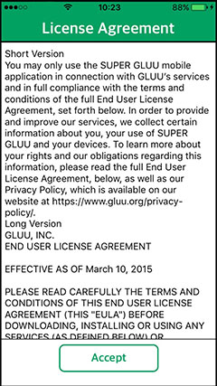
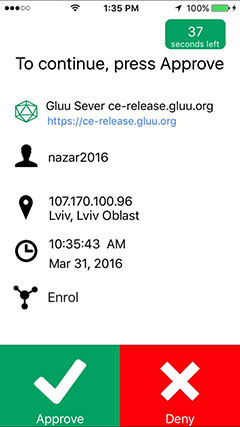
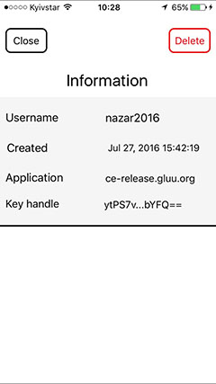
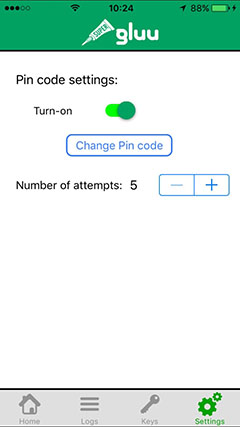

# Super Gluu User Guide
## Splash Screen

## Confirm Push Notification

The first time you load Super Gluu, it will ask you to choose if you want to receive push notifications from the Gluu Server. If you don't agree, you can do it later in your device settings. More information about the push notification will be covered later in the document.

## License Agreement

You must accept the license to use the application. You can scroll down to read the full Super Gluu EULA. Once you have accepted, it will not display the EULA again.

## PIN Protection

For additional security, you can configure a PIN to access Super Gluu. After you click `Yes`, you will be able to select a PIN. You can change your selection in the application settings later.

## Application Tabs

Once you have finished your configuration, you'll get to the main screen. You'll see a welcome message and the `Scan QR Code` button, as well as the tabs at the bottom, as follows:

- **Home:** takes you to the main screen
- **Logs:** shows all logs during enrollment/authentication
- **Keys:** contains all available keys saved on device, unique files the app uses to authenticate the device on the server side
- **Settings:** reconfigure your settings after initial setup

### Home

#### QR Code Enrollment

To enroll your device, enter your credentials in your Gluu Server web app to generate a QR code, after that, click the `Scan QR Code` button on the Super Gluu app's Home screen:

If the scanning process is completed and the server returns the request correctly, you will see an approval screen where you'll see information about the request and `Approve` and `Deny` buttons. To continue the enrollment/authentication process, click `Approve`:

The timer on the top right of the screen shows you how much time you have to choose to `Approve` or `Deny`. The color will change, yellow if it's under 20 seconds, red if it's under 10.

Next, you'll be returned to the Home screen, where you'll see whether or not you were successful.

### Logs

Each time you do enroll or authenticate, the app will save corresponding logs in the Logs tab. They are color coded, green for successes and red for failures.

You can clear the logs in this tab by tapping the `Clear` button.

 
 

The Log tab will inform you about the enrollment and authentication process and you can check who logged in, when, and from where. Click on the arrow button to see additional information.  

The information screen contains data about:

- Gluu server name & server URL
- Username
- IP address & location
- Time & date

### Keys

This tab contains all available keys for each Gluu server. A key is a unique file that is generated during enrollment, and is used to authenticate the device on the server. If you delete a key for a server, you should enroll again with a new key.

   

You can change a key's name by pressing it for 3 seconds. You will receive a prompt: `Do you want to change key's name?`

You can delete a key in two ways:

1) If you swipe left on the key, a delete button will appear on right side of the key

2) If you click on the key, a new information screen will appear. The `Delete` button is on the top right

### Settings

In the Settings tab, you can set up a new PIN, disable PIN protection, and change the number of failed attempts before being locked out for ten minutes. You can choose any limit between 5 and 10 attempts.

You can use either a simple 4-digit PIN or use a custom set-up.

## Push Notifications

Super Gluu can receive push notifications from Gluu servers. The server can send an enrollment or authentication request to the application, as if you scanned the QR code directly. 

After you have chosen to receive push notifications either during initial setup or through the Settings tab later, you need to enroll through the server. Super Gluu will send a token to the server, which will be used to send push notifications to the device.

When you receive a notification, you can `Approve` or `Deny` directly from the push menu. You have two options:

1) **If the device in locked:** Swipe left on the push notification, choose `Approve` or `Deny`

2) **If the device isn't locked:** Swipe down on the push notification, choose `Approve` or `Deny`

3) **If you click on the push notification:** You will be taken into app, choose `Approve` or `Deny`

Super Gluu can receive a notification when the application is running in the foreground. It will pop down from the top of the screen.  You can make your decision directly on this menu.

## Landscape Mode, Settings, iPad Support

Super Gluu can work in landscape mode, just rotate your device. Some components are hidden in landscape mode, just scroll up and down to see them.

 
 
 

If you go into the device settings, you will see a few settings for Super Gluu - push notifications, location, access to camera, and PIN protection. Any change made in the device settings will take effect in the application.

You can run Super Gluu on iPads, the layout is the same for all IOS devices.

For more information please see the [Gluu Website](http://gluu.org)
